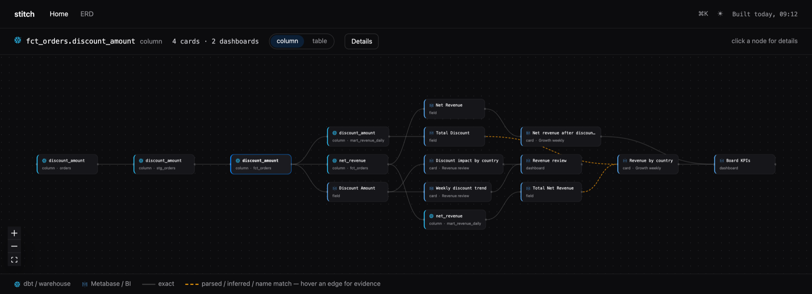
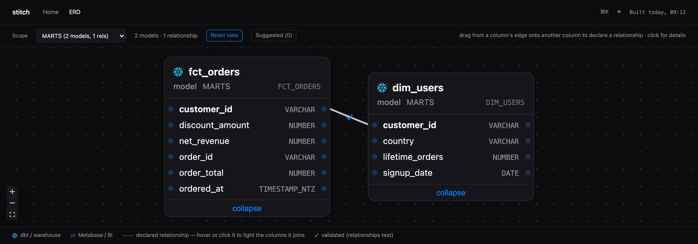

<p align="center">
  <picture>
    <source media="(prefers-color-scheme: dark)" srcset="assets/logo-dark.svg">
    
  </picture>
</p>

[](LICENSE)
[](pyproject.toml)
[](https://github.com/sverrbear/stitch-lineage/actions/workflows/ci.yml)

dbt ↔ Metabase column lineage — so you know what a column change breaks before you make it.

Use `stitch` to trace a column from its source table through your dbt models into the Metabase
fields, cards and dashboards that read it. It reads your dbt artifacts and the Metabase API and
writes one plain local file, `.stitch/graph.json`, which the CLI queries and the browser app draws.

stitch is **local-first**: no server, no warehouse backend, no hosted anything, and nothing it
generates needs to be committed. It reads Metabase, and the only thing it ever writes into your repo
is a relationship or description you explicitly asked it to apply. One command writes *out* —
[`stitch mend`](#repairing-what-broke-stitch-mend) repairs the cards a schema change broke, and every
write it makes is snapshotted, re-executed and reverted if the card does not run. Nothing else in the
tool touches Metabase with anything but a GET.

Requires **Python 3.11+**, a dbt project whose artifacts you can generate, and **Metabase 49 or
newer** (the first release with API keys).

This project is in active development — v0.2.1, alpha. Full design in [SPEC.md](SPEC.md) (v0.5);
work is tracked as [GitHub issues](https://github.com/sverrbear/stitch-lineage/issues).

<p align="center">
  
</p>
<p align="center">
  <sub><code>stitch serve</code> — one column's blast radius, source to dashboard. Synthetic demo project.</sub>
</p>

## Table of Contents

1. [Getting Started](#getting-started)
2. [What breaks if I change this column?](#what-breaks-if-i-change-this-column)
3. [Repairing what broke: `stitch mend`](#repairing-what-broke-stitch-mend)
4. [The app](#the-app)
5. [Configuration](#configuration)
6. [Coverage](#coverage)
7. [Roadmap](#roadmap)
8. [Built on](#built-on)
9. [FAQ](#faq)
10. [Contributing](#contributing)
11. [License](#license)

## Getting Started

### Installation

stitch is installed from git. There is no PyPI package — that is deliberate (see the
[FAQ](#why-is-there-no-pypi-package)):

```shell
pip install git+https://github.com/sverrbear/stitch-lineage.git
```

The browser app ships prebuilt, so installing never needs a node toolchain.

### Usage

From your dbt project root:

```shell
stitch init                      # write stitch.yml (a wizard, not a scaffolder)
stitch build                     # resolve dbt + Metabase into .stitch/graph.json
stitch serve                     # explore it at http://127.0.0.1:8787
```

`stitch init` reads `dbt_project.yml` and `target/manifest.json` for your project name, target path,
databases, schemas and model inventory, and never asks a question dbt already answers. It asks for
the Metabase URL and an API key, calls Metabase, proposes the database mapping
(`Metabase "Analytics" ↔ dbt "analytics" — confirm?`) and the `include_schemas` where your marts
actually live, then writes `stitch.yml`, a `.env.example` line and a `.gitignore` entry, and
finishes with a mini-doctor and the next command. Four inputs, under two minutes. **The API key is
never written to disk** — `stitch.yml` gets the `${STITCH_METABASE_API_KEY}` reference, and a
literal key in the file is a startup error rather than a warning.

`stitch build` needs `target/manifest.json` and `target/catalog.json`. Set `dbt.auto_docs: true` and
it runs `dbt docs generate` for you; otherwise run dbt yourself and pass `--no-docs`:

```shell
dbt docs generate
stitch build --no-docs           # --docs/--no-docs overrides dbt.auto_docs either way
```

Every other command reads that one graph file:

| Command | Description |
| ------- | ----------- |
| `stitch build` | Resolve dbt + Metabase into `graph.json`. `--no-metabase` does the dbt side only; `--check` exits 1 on drift against a committed graph. |
| `stitch impact` | What the last build changed, and what it hits. `--column <model.column>` for a point query, `--base <ref>` to diff a git ref. |
| `stitch mend` | Repair the Metabase cards a column change broke. `--plan` classifies and writes `.stitch/mend_plan.json`; `--apply` executes it. The only command that writes to Metabase. |
| `stitch serve` | The local lineage + ERD app on `127.0.0.1:8787` (`--port`, `--host`, `--no-open`). |
| `stitch search <term>` | Find models, columns, Metabase fields, cards and dashboards. |
| `stitch suggest` | Relationships worth declaring, strongest evidence first. |
| `stitch apply` | Write staged relationships and descriptions into model YAML (`--dry-run` shows the diff). |
| `stitch doctor` | Config, artifacts, graph and Metabase connectivity. `--unbound`, `--untraced`, `--unresolved-cards`, `--dead`, `--list-databases`, `--write-access`. |
| `stitch history` | The graph baselines past builds stored locally, keyed by commit sha. |
| `stitch export` | `--format jsonl` for agents and warehouses, `--format site` for a static build of the app. |
| `stitch --version` | Print the installed version. |

Everything except `build` and `doctor`'s connectivity checks works without the Metabase environment
variables set (`mend` is the exception: it needs them to read the cards it plans against). `--json` is
available on `impact --column`, `search`, `suggest`, `history` and `doctor --dead`, and
`impact --format json` emits the machine-readable diff. Add `.stitch/` to `.gitignore`; the graph is a local artifact.

## What breaks if I change this column?

That is the question stitch exists to answer, and it takes one command over the local graph — no
baseline, no git ref, no Metabase credentials, no CI job:

```
$ stitch impact --column fct_orders.discount_amount
fct_orders.discount_amount
  ├ 2 downstream models: fct_orders, mart_revenue_daily
  ├ 3 downstream columns:
      fct_orders.net_revenue
      mart_revenue_daily.discount_amount
      mart_revenue_daily.net_revenue
  ├ 4 Metabase fields: Discount Amount, Net Revenue, Total Discount, Total Net Revenue
  ├ 4 Metabase cards:
      #412 Discount impact by country  (Revenue review, dana)
      #418 Weekly discount trend  (Revenue review, dana)
      #503 Revenue by country  (Board KPIs, priya)
      #547 Net revenue after discounts  (Board KPIs, priya)
  └ 2 dashboards: Board KPIs, Revenue review
```

It takes `model.column`, a bare column name when that is unique, or a full node id; anything
ambiguous gets `search`-style suggestions rather than a guess.

The mirror question — *what did my last build just change?* — needs no argument. Every build copies
the graph it is about to overwrite to `.stitch/graph.prev.json` and closes with the difference,
staying silent when nothing changed:

```
since last build: 2 columns removed, 1 type-changed -> 4 cards on 2 dashboards affected (run 'stitch impact' for the tree)
```

`stitch impact` prints the tree behind that line. A rename shows up as a removal plus an addition:
ids are name-based, and the downstream card breaks either way until it is repointed.

**Baselines without committing anything.** Every build on a clean working tree also stores a
gzipped snapshot in `.stitch/history/<commit-sha>.json.gz`, so `--base` has somewhere local to look:

```shell
git switch main && stitch build     # history: stored baseline for a1b2c3d (1/20 kept)
git switch -c feat/rename-columns   # ... edit models, dbt docs generate ...
stitch build --no-docs
stitch impact --base main           # diffed against main's stored snapshot
```

`--base <ref>` resolves the ref to its merge-base with `HEAD`, then takes that commit's snapshot or
the nearest stored ancestor, and always prints the baseline it picked on stderr so it can never be a
guess. Builds with uncommitted changes store nothing and say so — that graph describes your working
tree, not the commit. `stitch history` lists what is stored.

In CI, `stitch impact --format github-comment` posts the same blast radius as a PR comment,
`--format slack` as a deploy alert (workflow templates in [`action/`](action/)), and
`--fail-on-impact` exits 1 when a column was removed or type-changed. That path does need a baseline
`graph.json` committed on the base branch, which is why it is not the default story.
`--format json` emits the same diff as data, which is what `stitch mend` runs on.

## Repairing what broke: `stitch mend`

Knowing that a deprecation broke 29 cards is only half a tool. `stitch mend` writes the repair.

```
stitch mend --plan --rename fct_orders.amount=fct_orders.amount_usd
```

It reads the impact diff and gives every affected card exactly one action:

| Action | When | Write |
|---|---|---|
| **repoint** | you declared the rename, and the new column resolves to a live Metabase field | rewrite the field reference across every query stage and the dashboard filter wiring |
| **strip** | the dead column only appears in clauses the card is not *about* — a filter, one breakout of several, an order-by | delete that clause |
| **archive** | the dead column *is* the card — its only aggregation, its sole dimension | `archived: true`, never a delete |
| **notify** | personal collections, native SQL, actions you dialed off — anything mend will not guess at | nothing; listed for a human |

```
⚠ stitch mend: 6 cards affected -- 2 strip, 1 archive, 1 repoint, 2 notify

STRIP (2) -- a clause is deleted -- the card runs, under the same title, showing different
numbers. Re-execution cannot catch that; read these.
  #402 Orders, promo cohort  (Order operations, Order ops, dev)
      removed filter -> fct_orders.promo_code
      dashboard 'Order operations': 1 filter mapping dropped

ARCHIVE (1) -- the card's substance is gone -- archived, never deleted
  #403 Promo uptake  (Order ops, analyst)
      fct_orders.promo_code is essential to this card (aggregation)

REPOINT (1) -- a declared rename, followed to the new field
  #401 Revenue by month  (Order operations, Order ops, dev)
      repointed aggregation: fct_orders.amount -> fct_orders.amount_usd
```

The plan is a file (`.stitch/mend_plan.json`), it renders as `text`, `slack` or `github-comment`, and
it is deterministic — the same graphs and the same renames produce the same bytes. **The plan is the
dry run.** Nothing has been written yet.

```
stitch mend --apply           # THIS writes to Metabase
```

Per card: re-read it and skip it if a human edited it since the plan (their edit outranks ours),
snapshot the revision, write, **re-execute the card**, and revert through Metabase's revision history
if it does not run. Every diff it writes is printed. Any card that ends `failed` exits non-zero.

Nothing is inferred: a repoint happens only where you declared `old=new`. A rename mend cannot follow
— because Metabase has not synced the new column yet, say — becomes a `notify`, never a strip, since
"I cannot find the new column" and "the column is gone" call for opposite repairs.

Autonomy is per action, in `stitch.yml`. `strip` is the one worth a decision: a card with a dead
filter removed still runs, and shows different numbers under the same title. Remove it from
`mend.auto` and those cards get listed instead of edited. `stitch doctor --write-access` checks that
the API key can write, and writes nothing itself. The post-deploy workflow — sync, build, impact,
plan, Slack notice, apply, summary, in one job — is
[`action/stitch-mend.yml`](action/stitch-mend.yml), which documents a human-gated variant alongside.

## The app

`stitch serve` opens a local browser app over the same file: search everything with `/` and `⌘K`,
per-node detail panels, the end-to-end lineage view above, and a scoped ERD. Every node carries the
badge of the system it lives in — Snowflake on the warehouse side, Metabase on the BI side — so a
glance shows where one ends and the other begins. Cards deep-link back into Metabase.

<p align="center">
  
</p>

In the ERD you can **draw** relationships: drag one column's handle onto another's, name the
cardinality, and the declaration stages locally. Nothing you do in the app touches your repo.
Relationships stage to `.stitch/staged_relationships.yml` and description edits to
`.stitch/staged_descriptions.yml`; `stitch apply` materializes them into your model YAML as one
reviewable step:

```diff
--- a/models/marts/_schema.yml
+++ b/models/marts/_schema.yml
       - name: customer_id
         description: 'Who placed the order'
+        config:
+          meta:
+            metabase.fk_target_table: marts.dim_customers
+            metabase.fk_target_field: customer_id
+            relationship_type: many-to-one
```

The write is deliberately conservative. It is **insert-only** — comments, quoting, key order and
blank lines survive byte-identically, and a file stitch cannot reproduce exactly is reported as
unappliable instead of reformatted. It **never invents files**: the target comes from the manifest's
`patch_path`, and a model with no schema YAML is reported, not scaffolded. A target with uncommitted
changes is refused unless you pass `--force`. What was applied is then patched into `graph.json`, so
the relationship is in the app on a refresh rather than after the next build.

Where to start is `stitch suggest`, which ranks the relationships nobody has declared yet.
**Implicit joins** come from Metabase itself — when a card reaches a column by joining through an
FK, the score is the number of cards already relying on a relationship nobody wrote down — and the
weaker **naming** convention (`<entity>_id` → matching-grain model) always ranks below a single
witnessing card. Pairs you have declared, staged or dismissed never come back.

`stitch export --format site` writes the same app as a static directory with the graph inlined into
`index.html` — no server, no API, and so read-only: the drawing affordances are simply absent.

## Configuration

`stitch.yml` lives at your dbt project root. `stitch init` writes it; only the `metabase` section is
required. `${ENV_VAR}` references are interpolated at load time anywhere in the file.

```yaml
dbt:
  project_dir: .
  auto_docs: true                       # run `dbt docs generate` at the start of every build

metabase:
  url: ${STITCH_METABASE_URL}
  api_key: ${STITCH_METABASE_API_KEY}   # env reference only; a literal key is an error
  databases:
    - metabase_name: "Analytics"        # display name in Metabase
      dbt_database: analytics           # database per the dbt manifest
      table_prefix: ${USER_PREFIX}_     # optional, stripped before matching
  include_schemas: [marts, reporting]
  exclude_models: ["stg_*"]

serve:
  erd_default_scope: "schema:marts"

output:
  history_retention: 20
```

### `dbt`

| Key | Required | Default | Description |
| --- | -------- | ------- | ----------- |
| `project_dir` | no | `.` | dbt project root, relative to `stitch.yml`. |
| `target_path` | no | `target/` | Where `manifest.json` and `catalog.json` live. |
| `auto_docs` | no | `false` | Run `dbt docs generate` at the start of every build. `--docs`/`--no-docs` overrides it per invocation. |
| `docs_args` | no | `[]` | Extra args for that command, e.g. `["--target", "prod"]`. |

### `metabase`

Required — stitch has no default Metabase to talk to.

| Key | Required | Default | Description |
| --- | -------- | ------- | ----------- |
| `url` | **yes** | — | Base URL of your Metabase instance. |
| `api_key` | **yes** | — | Must be a whole-value `${ENV_VAR}` reference; a literal key in the file is a startup error. |
| `databases` | **yes** | — | List of `metabase_name` ↔ `dbt_database` mappings, each with an optional `table_prefix` that is present on dbt's physical table names but absent in the BI database (dev artifacts against a prod-pointed Metabase) and stripped before matching. |
| `include_schemas` | no | `[]` (all) | Restrict binding to these schemas — normally where your marts live. |
| `exclude_collections` | no | `[]` | Metabase collections to skip entirely. |
| `exclude_packages` | no | `[]` | dbt packages not expected in Metabase (`elementary`, `dbt_artifacts`, …). They keep their lineage but leave the bind denominator, so "unbound" keeps meaning "expected and not found". |
| `exclude_models` | no | `[]` | The same, per model: `fnmatch` globs on the dbt model name, e.g. `["stg_*"]`. |
| `min_version` | no | `"0.49"` | Minimum Metabase version stitch will run against. |

### `relationships`

Controls what `stitch apply` writes for a relationship you declared in the app.

| Key | Required | Default | Description |
| --- | -------- | ------- | ----------- |
| `write_to` | no | `meta` | The written form: `meta` (dbt-metabase interop keys under the column's `config: meta:`) or `relationships_test` (a dbt `relationships` test on the FK column). `contract_constraint` is accepted by the config but not implemented — `apply` raises rather than write a shape it cannot round-trip. Contract constraints already in your repo are still *read* as relationship evidence. |
| `validated_test_severity` | no | `warn` | `severity:` on a written `relationships` test — warn, so a declaration never fails a pipeline. |
| `fk_meta_keys` | no | `["metabase.fk_target_table", "metabase.fk_target_field"]` | Exactly two keys: the target-table and target-field meta keys read and written for FK declarations. |
| `cardinality_meta_key` | no | `relationship_type` | Meta key carrying the cardinality — `dbterd`'s, by design. |

### `output`

| Key | Required | Default | Description |
| --- | -------- | ------- | ----------- |
| `dir` | no | `.stitch/` | Where the graph, staging stores, cache and history go. Local; gitignore it. |
| `history_retention` | no | `20` | SHA-keyed graph snapshots kept for `impact --base`; oldest pruned first. `0` turns history off and clears the directory. |
| `retain_cache_runs` | no | `3` | Metabase payload cache generations kept. |

### `serve`

Presentation defaults, shared by `stitch serve` and `export --format site`.

| Key | Required | Default | Description |
| --- | -------- | ------- | ----------- |
| `erd_default_scope` | no | none | ERD scope to open on: `schema:<name>` or `tag:<name>`. Anything else is a config error. |
| `strip_model_prefixes` | no | `[]` | Routing prefixes stripped from a model's *display* name, e.g. `["viz_"]`. Purely cosmetic — ids, search keys and everything written back keep the real dbt name. |

### `mend`

What [`stitch mend`](#repairing-what-broke-stitch-mend) is allowed to do without asking.

| Key | Required | Default | Description |
| --- | -------- | ------- | ----------- |
| `slack_webhook` | no | none | Where the plan notice and the apply summary are posted. Must be an env reference (`${STITCH_SLACK_WEBHOOK_URL}`) — a literal URL in `stitch.yml` is an error, like a literal API key. |
| `auto` | no | `[repoint, strip, archive]` | Actions applied without a human gate. Remove one and it downgrades to `notify`: the card is listed and written to by nobody. `notify` itself is not a valid entry — it is the absence of a write, not an autonomy level. |
| `notify_only_collections` | no | `["*Personal*"]` | Globs on collection name or full path (personal collections match `*Personal*` whatever they are named). Cards here are never written to. |

## Coverage

Every build prints what it could and could not resolve, so a thin graph is a documented limitation
instead of a mystery:

```
models bound         142/147   (5 unmatched -> stitch doctor --unbound)
MBQL cards           218/218
native SQL cards     38/41   parsed
dashboards           19/19
dbt column lineage   1842/1901 columns traced   (37 inferred via star-expansion, 22 unresolved -> stitch doctor --untraced)
```

MBQL cards resolve exactly, including card-on-card sources. Native SQL cards resolve by parsing:
stitch substitutes the card's template tags (`{{variable}}`, `[[optional clauses]]`,
`{{snippet: name}}`, `{{#123-card}}`), parses the result with sqlglot, and maps every column that
lands on a table Metabase knows to that table's field — so a hand-written card's columns join the
same lineage chain an MBQL card's do, marked `parsed` rather than `exact`. Anything that will not
parse degrades to the tables it reads; no card is ever dropped, and no column is ever invented.
Both query shapes are handled, the legacy `dataset_query.query` and the MBQL 5 `stages` form modern
Metabase returns.

Run the same edges backwards and you get estate hygiene: `stitch doctor --dead` reports unconsumed
columns, models feeding nothing, and archived cards still bound to live columns. It prints its own
caveat every time — stitch only sees Metabase, so a column no card reaches may still be read by
reverse ETL, a notebook or another BI tool. Candidates to review, never a delete queue.

## Roadmap

| Phase | Scope | Status |
|---|---|---|
| **0** | `build` (dbt column lineage via sqlglot + MBQL cards), deterministic `graph.json` + `--check`, coverage report, recursive `impact` incl. `--column` and SHA-keyed history, `search`, `doctor` incl. `--dead` | **shipped** |
| **1** | `serve`: search + detail panels, lineage view, catalog, read-only ERD; `export --format site` | **shipped** |
| **2** | Editable ERD canvas: staged relationships and descriptions, `stitch apply` with diff preview, suggestions, `stitch init` | **shipped** — except saved views and node positions (#31), composite and conceptual relationship shapes (#55) |
| 3 | Native SQL cards via sqlglot and MBQL 5 stages (**shipped**, ahead of phase order); rename heuristics, `--verify-lineage`, Metabase version matrix | ongoing |
| 4 | `stitch mend`: impact-driven card remediation — plan, Slack notice, reversible auto-apply; `doctor --write-access` | ongoing |

The issue tracker, not this table, is the operational truth.

## Built on

stitch reuses the conventions of the tools next to it rather than reinventing them (SPEC §2):
relationship metadata is written in `dbt-metabase`'s and `dbterd`'s meta keys, so those tools keep
working unchanged on a stitch-annotated repo.

- [sqlglot](https://github.com/tobymao/sqlglot) — SQL parsing and column-level lineage over dbt compiled SQL
- [dbt-metabase](https://github.com/gouline/dbt-metabase) — FK/semantic-type/description sync into Metabase; stitch's `metabase.fk_target_*` keys are interop-compatible by design
- [dbterd](https://github.com/datnguye/dbterd) — ERD conventions; stitch matches its `relationship_type` meta key
- [typer](https://github.com/fastapi/typer), [pydantic](https://github.com/pydantic/pydantic), [ruamel.yaml](https://sourceforge.net/projects/ruamel-yaml/), [requests](https://github.com/psf/requests), [rich](https://github.com/Textualize/rich) — CLI, data contracts, round-trip YAML write-back, Metabase API, terminal output
- [FastAPI](https://github.com/fastapi/fastapi), [uvicorn](https://github.com/encode/uvicorn), [React Flow](https://github.com/xyflow/xyflow) — `stitch serve`

## FAQ

### Does it need a server?

No. stitch is a CLI that writes one file and a local app that reads it. There is no service to
deploy, no database to provision and no account to create. `stitch serve` binds `127.0.0.1` by
default, and `stitch export --format site` produces a static directory you can host anywhere for
people who will never run a CLI.

### Will this slow down my dbt build?

By default it adds nothing: `relationships.write_to` is `meta`, so an applied declaration is
metadata on a column and no test runs. If you set `write_to: relationships_test`, stitch writes a
real dbt `relationships` test at `severity: warn` (`relationships.validated_test_severity`) — it
reports, it does not fail your pipeline. Raise it yourself if you want it to.

### What about native SQL cards?

They are resolved, by parsing the SQL with sqlglot after substituting the card's template tags, and
they are counted separately in the coverage report as `parsed` rather than `exact`. This was phase 3
work that shipped early. Cards whose SQL will not parse degrade to the tables they read and are
listed by `stitch doctor --unresolved-cards` with the reason — never dropped, never guessed.

### Which Metabase versions are supported?

Metabase 49 and newer, which is where API keys arrive; stitch never wants a password. The floor is
`metabase.min_version` (default `"0.49"`) if you need to move it. Both the legacy and MBQL 5 query
shapes are handled, so modern instances resolve the same as older ones.

### Does `stitch build` run dbt?

Only if you ask it to. With `dbt.auto_docs: true` (or `--docs`) it runs `dbt docs generate` first,
which connects to your warehouse — **if your dbt profile uses MFA, expect a push notification**.
With `--no-docs` it reuses whatever is already in `target/` and touches nothing.

### Do I have to commit anything?

No. `.stitch/` is local and gitignored, including the per-commit baselines `impact --base` reads.
Teams that want git history of the graph can commit it, and the CI comment workflow does need that,
but nothing in the local flow requires it.

### Why is there no PyPI package?

Distribution is deliberately git-install (SPEC.md). stitch is alpha and pinned to conventions in
your own repo; installing from a ref you chose keeps you in control of when it changes. The
packaging is real — `pyproject.toml` builds a wheel with the app bundled — so this can change later
without anything else changing.

## Contributing

Contributions are welcome. Issues and PRs are the unit of work; the same checks CI runs are the ones
to run locally:

```shell
python3 -m venv .venv && source .venv/bin/activate
pip install -e ".[dev]"

pytest -q             # unit + end-to-end tests
ruff check .          # lint
ruff format --check . # formatting
lint-imports          # architecture seams (SPEC.md §4)
```

The app's source lives in [`stitch_lineage/app/frontend/`](stitch_lineage/app/frontend/) and its own
README covers that stack. The built `dist/` is committed and bundled into the wheel — rebuild it
with `npm run build` there whenever `src/` changes.

## License

`stitch` is distributed under the terms of the [MIT license](LICENSE).
